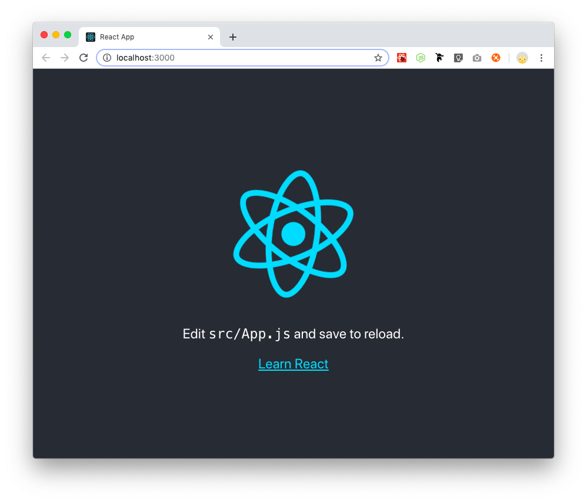
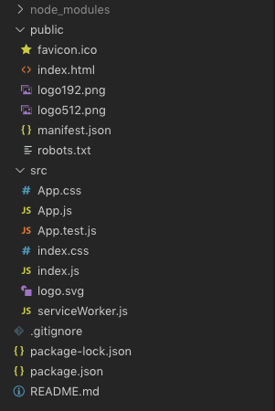
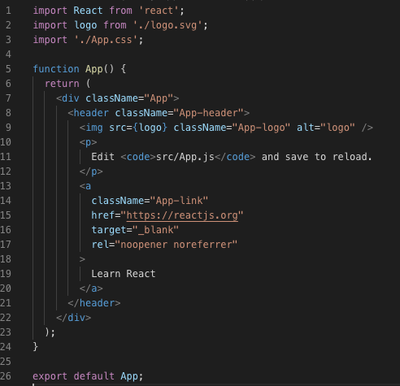

# ReactJS

React merupakan pustaka bahasa pemrograman JavaScript untuk membangun antar muka pengguna. Membangun antara muka pengguna dapat dilakukan dengan berbagai macam cara, masing-masing cara tentunya memiliki kelebihan dan kekurangan, salah satu hal yang ditawarkan oleh React adalah komponen antar muka yang dapat digunakan kembali, dengan demikian komponen yang sudah dibuat dapat digunakan pada beberapa tempat, sehingga diharapkan waktu pengembangan menjadi lebih efisien.

React biasanya digunakan untuk membangun Single Page Application (SPA), hal ini cocok untuk membangun aplikasi yang interaktif, misalnya pada sebuah halaman yang membutuhkan sebuah aksi tertentu pada sebuah komponen, dan mengeluarkan hasil pada komponen lain tanpa perlu memuat ulang halaman.

React dapat digunakan dari awal hingga akhir, yang semuanya menggunakan React, atau juga dapat disisipkan pada aplikasi yang sudah ada, yang dibangun dengan pustaka atau bahasa pemrograman lain, sehingga apabila ingin mulai migrasi menggunakan React tidak perlu membangun nya langsung dari awal, namun bisa juga dengan cara bertahap.

Dalam modul ini kita akan menggunakan React dari awal hingga akhir untuk membangun sebuah aplikasi yang akan berkomunikasi dengan REST API dan membutuhkan autentikasi.

Mari kita mulai

## Studi Kasus

Studi kasus yang akan kita gunakan yaitu kita akan membuat sebuah aplikasi blog, yang memiliki fitur input artikel dan komentar.

## Menyiapkan Aplikasi

Kita akan menggunakan create-react-app untuk menyiapkan aplikasi, ketik peraintah berikut:

```
$ npx create-react-app pencatat
```

Perintah tersebut akan membuat sebuah folder yang di dalam nya sudah berisi sekumpulan file dan folder yang merupakan template aplikasi React, juga sudah dikonfigurasi sehingga siap digunakan untuk mulai membuat aplikasi React.

Selanjutnya, masuk ke folder pancatat, dan jalankan aplikasi React.

```
$ cd pencatat
$ npm start
```

Perintah tersebut akan menjalankan aplikasi, dan juga otomatis membuka peramban (browser) dan mengakses URL aplikasi React (http://localhost:3000).

Hasil pada peramban secara bawaan akan muncul tampilan sebagai berikut:



## Struktur Direktori

Secara bawaan, template yang dibuat oleh script ```create-react-app``` adalah sebagai berikut:



* Direktori node_modules, berisi paket-paket yang dibutuhkan, direktori ini digunakan untuk menyimpan paket-paket eksternal yang digunakan oleh aplikasi.
* Direktori public, berisi berkas html dan berkas statik lainnya yang digunakan oleh aplikasi, dan akan diletakkan di layanan http.
* Direktori src, berisi kode sumber React, kita akan banyak melakukan penulisan kode program di direktori ini
* File .gitignore, berkas yang digunakan oleh git untuk memberitahu git bahwa alamat berkas yang ada di berkas ini tidak dimonitor oleh git
* File package-lock.json, berkas yang berisi detil paket-paket yang ada di node_modules, berkas ini digunakan oleh perangkat npm
* File package.json, berkas ini mendefinisikan project, dependensi, dan skrip-skrip yang berkaitan dengan proyek.
* File `README.md`, berkas ini dimaksudkan sebagai catatan proyek.

## Aliran Aplikasi

Ketika kita menjalankan ```npm start```, Node akan mengeksekusi berkas `src/index.js`, kita lihat apa yang ada di dalam berkas tersebut:

```
import React from 'react';
import ReactDOM from 'react-dom';
import './index.css';
import App from './App';
import * as serviceWorker from './serviceWorker';

ReactDOM.render(<App />, document.getElementById('root'));

// If you want your app to work offline and load faster, you can change
// unregister() to register() below. Note this comes with some pitfalls.
// Learn more about service workers: https://bit.ly/CRA-PWA
serviceWorker.unregister();
```
x 
Pada baris `ReactDOM.render(<App />, document.getElementById('root'));`, Komponen `App` akan dirender ke ID `root`, di mana ID `root` ini ada di dalam berkas `public/index.html`.

## JSX

Untuk menulis kode HTML, react menggunakan JSX (JavaScript XML), bisa kita analogikan seperti tempate engine, contoh penggunaanya seperti yang terdapat dalam `App.js` pada aplikasi yang baru saja di-generate.



## Components

Pada penjelasan sebelum nya sempat disinggung mengenai Komponen, sederhananya Komponen merupakan sebuah bagian dalam sebuah UI, setiap aplikasi React dibagi dalam komponen-komponen yang independen dan terisolasi satu dengan lainnya.

Secara teknis, komponen dalam React seperti sebuah fungsi dalam JavaScript, yang dapat menerima input (disebut sebagai `props`) dan menghasilkan keluaran berupa elemen yang dapat ditampilkan di layar.

Komponen dapat dibuat dengan Class atau Fungsi, sebagai contoh:

Membuat komponen dengan fungsi:

```
function Hello(props) {
    return <h1>Hello, {props.name}</h1>
}
```

Membuat komponen dengan Class:

```
import React

class Hello extends React.Component {
    render() {
        return <h1>Hello, {props.name}</h1>
    }
}
```

## State

State secara sederhana dapat dijelaskan sebagai tempat penyimpanan internal dalam sebuah komponen, sebagai contoh misalnya dalam sebuah komponen untuk menyimpan data status aktif atau tidak aktif, contoh komponen yang menggunakan state sebagai berikut:

```
import React from 'react';
import './App.css';

class App extends React.Component {
  constructor() {
    super()
    this.state = {
      status: true
    }
  }

  changeStatus() {
    this.setState({status: !this.state.status})
  }

  render() {
    return (
      <div className="App">
        <header className="App-header">
          <h1>{this.state.status ? 'Aktif' : 'Tidak Aktif'}</h1>
          <button onClick={()=> this.changeStatus()}>Ubah Status</button>
        </header>
      </div>
    )
  }
}

export default App;
```

## Props

`Props` secara sederhana dapat dianalogikan seperti argumen dalam fungsi, `Props` di React dapat digunakan untuk melewatkan argumen ke Komponen, contoh penggunaan `Props` dapat dilihat pada potongan kode program berikut:

Component 1:
```
class Hello extends React.Component {
  render() {
    return <h1>Hello, {this.props.name}</h1>;
  }
}
```

Component 2:
```
class Example extends React.Component {
  render() {
    return <Hello name='Piko'>;
  }
}
```

## Siklus Component

Untuk lebih memahami bagaimana React bekerja, maka kita bahas tentang siklus hidup sebuah komponen, secara sederhana siklus hidup komponen dapat dikelompokkan menjadi empat, yaitu:

* Inisialiasi

Tahap ini merupakan tahap dimana komponen mulai dipanggil, apabila kita ingin melakukan sesuatu pada tahap inisialisasi, maka kita dapat memberikan instruksi pada method `constructor()`, contoh nya yaitu bila kita menggunakan `state` maka kita menginisiasi `state` di method `constructor()`

* Mounting

Tahap ini terjadi ketika komponen akan di-mount ke DOM, pada tahap ini terdapat beberapa method yang tersedia yang dapat digunakan sesuai kebutuhan, yaitu:
  
  * `componentWillMount()`
  * `componentDidMount()`

* Updating

Tahap ini terjadi setelah tahap mounting, tahap ini juga terjadi ketika state pada komponen berubah. Ada pun method yang terdapat pada tahap ini adalah sebagai berikut:

  * `shouldComponentUpdate()`
  * `componentWillUpdate()`
  * `componentDidUpdate()`

* Unmounting

Tahap ini terjadi ketika komponen akan di-unmount dari DOM, method yang tersedia yaitu:

  * `componentWillUnmount()`

Adapun diagram di bawah ini dapat membantu memahami siklus hidup komponen React:


Sumber: [React Lifecycle](https://twitter.com/dan_abramov/status/981712092611989509)

## Form

Untuk membuat form di React sama seperti di HTML biasa, sebagai contoh kode berikut ini:

```
  render() {
    return (
      <div className="App">
        <form>
          <textarea />
        </form>
      </div>
    )
  }
```

Namun penanganan Form di React berbeda dengan penanganan Form di HTML biasa, penanganan form di React ditangani oleh komponen. Untuk mengirim data form di React pada umumnya menggunakan fungsi javascript yang akan menangani aksi submit form.

## Router

To be written.

## Studi Kasus 1

To be written.

## Studi Kasus 2

To be written.
